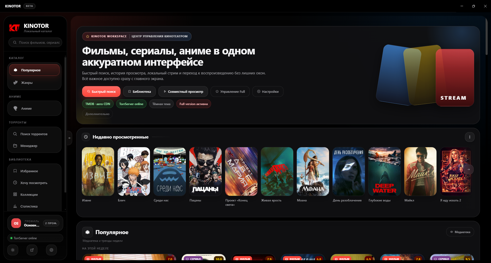
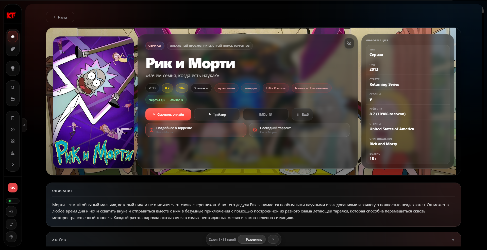
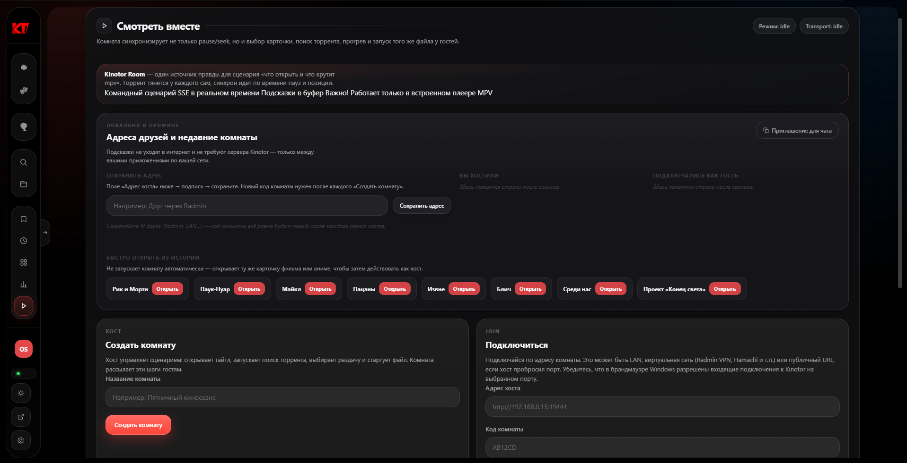
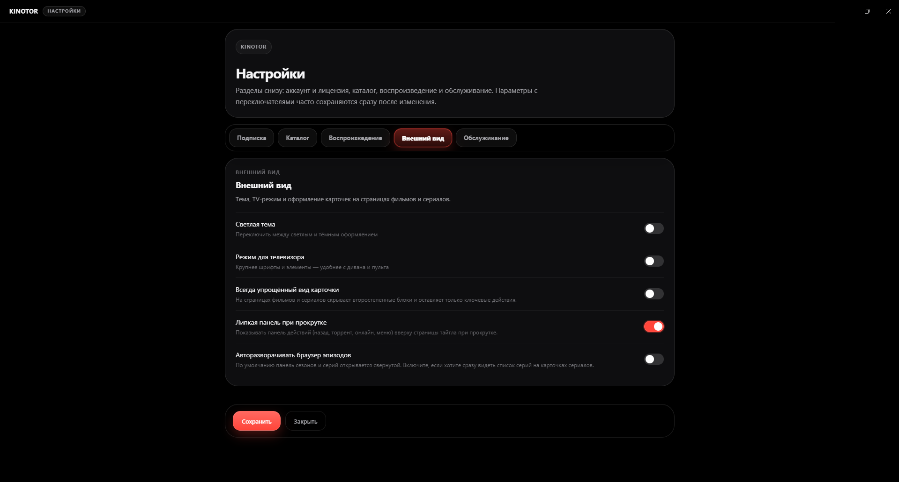

# Kinotor

**Бесплатный киноцентр для Windows** — фильмы, сериалы и аниме. Торрент-стриминг, медиатека, Watch Party.

[⬇ Скачать Kinotor](https://github.com/wendercurent/KinoTor/releases/latest) · [Telegram](https://t.me/kinotorapp) · [История изменений](CHANGELOG.md) · [English](README.en.md)

---

## Kinotor — что это?

**Kinotor** (Кинотор) — десктопное приложение для Windows: каталог **фильмов и сериалов** (TMDB), **аниме** (Shikimori), личная **медиатека**, **торрент-плеер** без полной загрузки на диск, **совместный просмотр** с друзьями (Watch Party). Альтернатива браузерным кинотеатрам: всё в одном окне, как **Kinorium** / **Кинопоиск**, но локально на ПК.

> 📦 **Этот репозиторий** — документация и [установщики в Releases](https://github.com/wendercurent/KinoTor/releases). **Исходный код закрыт** — распространяется готовое приложение.

**Популярные запросы:** смотреть фильмы торрент windows · торрент плеер для пк · каталог аниме shikimori · стриминг торрентов · медиатека фильмов · watch party синхронный просмотр · tmdb каталог · electron кинотеатр

---

## Скриншоты

> Положите PNG в `docs/screenshots/` — пути ниже уже настроены.

| Главная | Карточка тайтла |
|:---:|:---:|
|  |  |

| Аниме | Watch Party |
|:---:|:---:|
|  |  |

---

## Возможности

| Функция | Описание |
|---------|----------|
|**Фильмы и сериалы** | Популярное, поиск, жанры, коллекции TMDB, актёры |
|**Аниме** | Лента, поиск и жанры Shikimori |
|**Медиатека** | Избранное, «Хочу посмотреть», история, прогресс серий, оценки |
|**Торренты** | Поиск по трекерам, менеджер, **стриминг без скачивания** (TorrServer) |
|**Плееры** | Встроенный, VLC, MPV, MPC-BE |
|**Субтитры** | Поиск и подключение к просмотру |
|**Статистика** | Активность, шаринг постера библиотеки |
|**Рандомайзер** | «Что посмотреть?» — случайный тайтл |
|**Watch Party** | Совместный просмотр: хост + гости в синхроне |
|**Профили** | Несколько локальных профилей (полная версия) |
|**Темы** | Тёмная / светлая, интерфейс в стиле Kinorium |

Базовый функционал **бесплатно**. Расширенный поиск торрентов и профили — [полная версия](https://t.me/kinotorapp) (`KINO1.*`).

---

## Системные требования

| | Минимум | Рекомендуется |
|---|---------|---------------|
| **ОС** | Windows 10 x64 | Windows 11 |
| **ОЗУ** | 4 ГБ | 8+ ГБ |
| **Диск** | ~500 МБ | + кэш TorrServer |
| **Сеть** | Интернет | Стабильный канал для стриминга |

---

## Скачать и установить

### 1. Скачать

**[→ Последний релиз на GitHub](https://github.com/wendercurent/KinoTor/releases/latest)**

| Файл | Для кого |
|------|----------|
| `Kinotor Setup X.Y.Z.exe` | **Установщик** — рекомендуется |
| `Kinotor X.Y.Z.exe` | **Portable** — без установки |

### 2. Установка

1. Запустите установщик.
2. SmartScreen: «Подробнее» → «Выполнить в любом случае» ([почему?](#проверка-на-virustotal)).
3. Завершите мастер → Kinotor в меню «Пуск».

**Portable:** сохраните `.exe` в папку и запустите.

### 3. Первый запуск

1. Загрузочный экран → выбор режима аудитории.
2. TorrServer стартует автоматически (можно отключить в настройках).
3. Карточка фильма → **Торренты** → раздача → **Смотреть**.

📖 [Краткое руководство](docs/user-guide/getting-started.ru.md) · [FAQ](docs/user-guide/faq.ru.md)

Обновления: **Настройки → Обслуживание → Проверить обновления** (GitHub Releases).

---

## Проверка на VirusTotal

Установщик проверяется перед каждым релизом:

🔗 **Последняя сборка:** https://www.virustotal.com/gui/file/5de353ae1e429012d8d2dc202bac9d16c893c0156987e9cf269aa293cad2aaba

### Почему антивирус может ругаться?

Kinotor на **Electron** (как Discord, VS Code). Неподписанные сборки часто дают **ложные срабатывания** — это не вирус, если файл с [официального Releases](https://github.com/wendercurent/KinoTor/releases) и хеш совпадает с VT.

---

## Частые вопросы

<b>TorrServer не запускается</b>

Настройки → TorrServer → автозапуск. Порт `8090` свободен. Перезапуск приложения. Исключение в антивирусе для папки Kinotor.

<b>Не грузятся постеры / пустой каталог</b>

Интернет. Настройки → Каталог → источник изображений (`auto`). Перезапуск.

<b>Торренты не находятся</b>

Карточка тайтла → «Искать торренты». TorrServer online. Автопоиск в настройках.

<b>SmartScreen блокирует</b>

Приложение без код-подписи Microsoft. Скачивайте только с GitHub + VirusTotal.

<b>Watch Party — гости не подключаются</b>

Одна сеть или доступ к IP хоста. Файрвол Windows для порта комнаты.

Полный FAQ: [docs/user-guide/faq.ru.md](docs/user-guide/faq.ru.md)

---

## Структура репозитория

| Папка | Содержимое |
|-------|------------|
| `docs/` | Руководства, скриншоты, юридические тексты |
| `assets/` | Брендинг и иконки (для README) |
| `src/`, `renderer/` | Исходники **не публикуются** — см. README в папках |
| **Releases** | Установщики Windows |

---

## Связь

- **Telegram:** [@kinotorapp](https://t.me/kinotorapp) — новости, лицензии, поддержка
- **Issues:** баги и идеи (без PR с кодом)

---

## Лицензия

[LICENSE](LICENSE) — распространение бинарников. Исходный код закрыт.

**Beta 0.1.x:** возможны ошибки. Экспорт данных: Настройки → Обслуживание.

Kinotor — инструмент личного просмотра. Соблюдайте законы вашей страны.

---

## Поиск и теги (SEO)

**Русский:** Kinotor, Кинотор, кинотеатр windows, смотреть фильмы торрент, торрент плеер, стриминг торрентов, каталог фильмов tmdb, аниме shikimori, медиатека фильмов, совместный просмотр, watch party, kinorium аналог, торрсервер, electron кино, бесплатный кинотеатр пк

**English:** Kinotor, windows movie app, torrent streaming player, anime catalog, TMDB browser, watch party desktop, TorrServer client, media library movies

**Рекомендуемые GitHub Topics** (Settings → General): `electron`, `windows`, `movies`, `anime`, `torrent`, `tmdb`, `shikimori`, `media-player`, `watch-party`, `russian`

---

### [⬇ Скачать Kinotor для Windows](https://github.com/wendercurent/KinoTor/releases/latest)

Сделано с ❤️ для тех, кто любит кино и аниме

